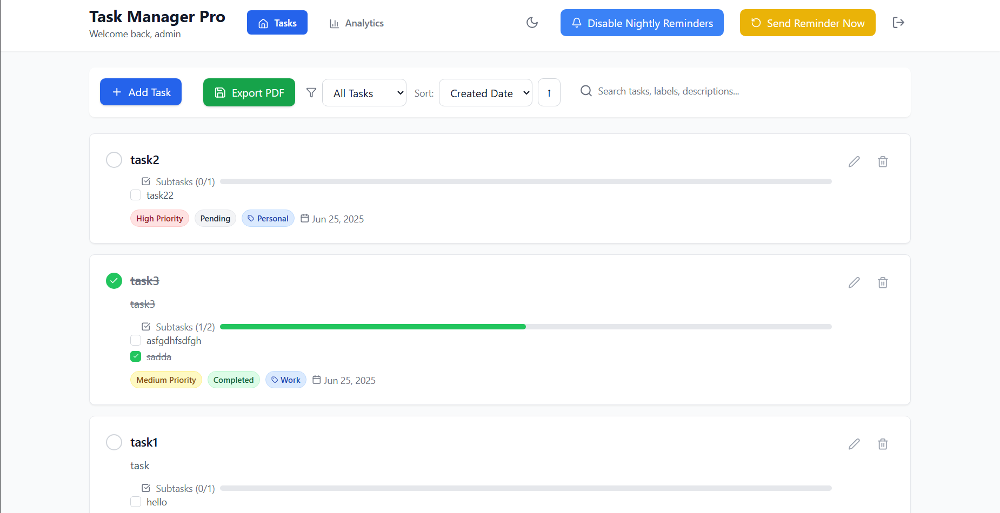

# Task Manager Pro

A comprehensive full-stack task management application that helps users organize, track, and manage their tasks efficiently. Built with React frontend and Node.js/Express backend, featuring user authentication, advanced task management, analytics, and automated email reminders.

## 🚀 Features

### 🔐 Authentication & Security
- User registration and login system
- JWT-based authentication with secure tokens
- Password hashing with bcrypt
- Protected routes and persistent sessions

### 📋 Advanced Task Management
- **Full CRUD Operations**: Create, read, update, and delete tasks
- **Status Tracking**: Pending, In Progress, and Completed states
- **Priority Levels**: High, Medium, and Low priority classification
- **Due Dates**: Set deadlines with overdue indicators
- **Labels & Tags**: Organize tasks with custom labels
- **Subtasks**: Break down complex tasks into manageable subtasks
- **Progress Tracking**: Visual progress bars for subtask completion
- **Bulk Operations**: Efficiently manage multiple tasks

### 🔍 Smart Filtering & Search
- **Real-time Search**: Search across task titles, descriptions, and labels
- **Multiple Filters**: Filter by status, priority, or overdue tasks
- **Flexible Sorting**: Sort by creation date, due date, priority, or title
- **Advanced Queries**: Combine filters for precise task discovery

### 📊 Analytics & Insights
- **Visual Dashboard**: Task status and priority distribution charts
- **Performance Metrics**: Completion rates and productivity trends
- **Overdue Tracking**: Monitor tasks requiring immediate attention
- **Progress Statistics**: Track overall productivity and goal achievement

### 📧 Smart Notifications
- **Automated Reminders**: Nightly email reminders for pending tasks
- **Instant Notifications**: Send task summaries on-demand
- **User Preferences**: Customizable reminder settings
- **Smart Scheduling**: Only sends reminders when tasks are pending

### 📄 Export & Reporting
- **PDF Generation**: Create professional task reports
- **Comprehensive Reports**: Include task details, subtasks, and analytics
- **Modern Design**: Clean, formatted output with color-coded priorities

### 🌟 User Experience
- **Dark/Light Mode**: Toggle between theme preferences
- **Responsive Design**: Optimized for desktop, tablet, and mobile
- **Intuitive Interface**: Clean, modern UI with smooth animations
- **Real-time Updates**: Instant feedback and notifications

## 🛠 Technology Stack

### Frontend
- **React 18+** - Modern React with Hooks and Context API
- **Lucide React** - Beautiful, customizable icon library
- **jsPDF** - Client-side PDF generation
- **Tailwind CSS** - Utility-first styling framework

### Backend
- **Node.js** - JavaScript runtime environment
- **Express.js** - Fast, unopinionated web framework
- **MongoDB** - NoSQL database with Mongoose ODM
- **JWT** - JSON Web Tokens for authentication
- **bcrypt** - Password hashing and security
- **node-cron** - Task scheduling for automated reminders

### Additional Tools
- **Email Service** - Custom email notification system
- **Input Validation** - Comprehensive data validation
- **Error Handling** - Robust error management and logging

## 🏗 Project Structure

```
TaskManagement/
├── frontend/                 # React frontend application
│   ├── src/
│   │   ├── components/     # Reusable UI components
│   │   └── App.jsx         # Main application component
│   ├── public/             # Static assets
│   └── package.json        # Frontend dependencies
├── backend/                 # Node.js backend API
│   ├── models/             # MongoDB/Mongoose models
│   ├── email.js            # SMTP email server
│   └── server.js           # Express server entry point
└── README.md              # This file
```

## 🚀 Getting Started

### Prerequisites
- **Node.js** (v14 or higher)
- **MongoDB** (local installation or MongoDB Atlas)
- **npm** or **yarn** package manager

### Installation

1. **Clone the repository**
```bash
git clone https://github.com/sumedhudupa/TaskManagement.git
cd TaskManagement
```

2. **Backend Setup**
```bash
cd server
npm install

# Create environment file
cp .env.example .env
# Edit .env with your configuration
```

3. **Frontend Setup**
```bash
cd ../client
npm install

# Create environment file
echo "REACT_APP_API_URL=http://localhost:4000/api" > .env
```

4. **Database Setup**
- Install MongoDB locally or create a MongoDB Atlas account
- Update the `MONGODB_URI` in your server `.env` file

5. **Start the Application**

Backend (from server directory):
```bash
npm start
```

Frontend (from client directory):
```bash
npm start
```

The frontend will be available at `http://localhost:3000` and the backend at `http://localhost:4000`.

## ⚙️ Configuration

### Environment Variables

**Backend (.env)**
```env
MONGODB_URI=mongodb://localhost:27017/taskmanager
JWT_SECRET=your-super-secret-key
PORT=4000
NODE_ENV=development
SMTP_USER=your-email@domain.com
SMTP_PASS=your-email-password
```

**Frontend (.env)**
```env
REACT_APP_API_URL=http://localhost:4000/api
```

## 📖 API Documentation

### Authentication Endpoints
- `POST /api/register` - User registration
- `POST /api/login` - User authentication

### Task Management
- `GET /api/tasks` - Retrieve tasks with filtering and sorting
- `POST /api/tasks` - Create new task
- `PUT /api/tasks/:id` - Update existing task
- `DELETE /api/tasks/:id` - Delete single task

### Analytics & Statistics
- `GET /api/stats` - Get comprehensive task statistics

### User Preferences
- `GET /api/user/me` - Get current user info
- `PATCH /api/user/nightly-reminders` - Update notification preferences

### Notifications
- `POST /api/send-reminder` - Send manual task reminder

For detailed API documentation with request/response examples, see the [API Documentation](backend/api.md).

## 🎯 Usage Guide

### Getting Started
1. **Register**: Create your account with email and password
2. **Add Tasks**: Click "Add Task" to create your first task
3. **Organize**: Use priorities, labels, and due dates to organize
4. **Track Progress**: Monitor completion in the analytics dashboard
5. **Stay Updated**: Enable nightly reminders for daily summaries

### Pro Tips
- Use **labels** to categorize related tasks
- Set **due dates** to track deadlines effectively
- Break large tasks into **subtasks** for better progress tracking
- Export **PDF reports** for documentation and sharing
- Enable **dark mode** for comfortable evening work sessions

## 🚢 Deployment

### Backend Deployment (Railway/Heroku/DigitalOcean)
1. Set production environment variables
2. Configure MongoDB Atlas connection
3. Deploy using your preferred platform

### Frontend Deployment (Netlify/Vercel)
1. Build the React application: `npm start`
2. Configure API URL for production
3. Deploy the build folder

## 🔒 Security Features

- **JWT Authentication** - Secure token-based authentication
- **Password Hashing** - bcrypt encryption for user passwords
- **Input Validation** - Comprehensive data validation and sanitization
- **Protected Routes** - Authentication middleware for secure endpoints
- **User Data Isolation** - Users can only access their own data
- **Environment Security** - Sensitive data stored in environment variables

## 📊 Performance Features

- **Database Indexing** - Optimized MongoDB queries
- **Efficient State Management** - Minimal re-renders with React best practices
- **Responsive Design** - Mobile-first approach for all devices

## 🤝 Contributing

We welcome contributions! Please follow these steps:

1. **Fork** the repository
2. **Create** a feature branch (`git checkout -b feature/AmazingFeature`)
3. **Commit** your changes (`git commit -m 'Add some AmazingFeature'`)
4. **Push** to the branch (`git push origin feature/AmazingFeature`)
5. **Open** a Pull Request

### Development Guidelines
- Follow existing code style and conventions
- Write tests for new features
- Update documentation as needed
- Ensure all tests pass before submitting PR

## 🐛 Troubleshooting

### Common Issues

**Database Connection Error**
- Verify MongoDB is running
- Check `MONGODB_URI` in environment variables

**Frontend API Connection Error**
- Ensure backend server is running on correct port
- Verify `REACT_APP_API_URL` configuration

**Authentication Issues**
- Check JWT secret configuration
- Verify token expiration settings

## 🔮 Roadmap

### Upcoming Features
- **Team Collaboration** - Share tasks and projects with team members
- **Calendar Integration** - Sync with Google Calendar and Outlook
- **Mobile App** - Native iOS and Android applications
- **Advanced Analytics** - Detailed productivity insights and trends
- **API Webhooks** - Integration with third-party services
- **Recurring Tasks** - Automated task creation for recurring activities
- **Docker Deployment** - Dockerise the application for easy deployment

## 📄 License

This project is licensed under the MIT License - see the [LICENSE.md](LICENSE.md) file for details.

## 🙏 Acknowledgments

- Thanks to all contributors who have helped shape this project
- Inspired by popular task management tools like Todoist and Asana
- Built with modern web development best practices

## 📞 Support

- **Documentation**: Check our [Wiki](https://github.com/sumedhudupa/TaskManagement/wiki)
- **Issues**: Report bugs on [GitHub Issues](https://github.com/sumedhudupa/TaskManagement/issues)
- **Discussions**: Join conversations in [GitHub Discussions](https://github.com/sumedhudupa/TaskManagement/discussions)
- **Email**: Contact us at sumedhudupa15@gmail.com

---

**Task Manager Pro** - Organize your tasks, maximize your productivity! 🚀

[](https://github.com/sumedhudupa/TaskManagement)
[](LICENSE.md)
[](CONTRIBUTING.md)



